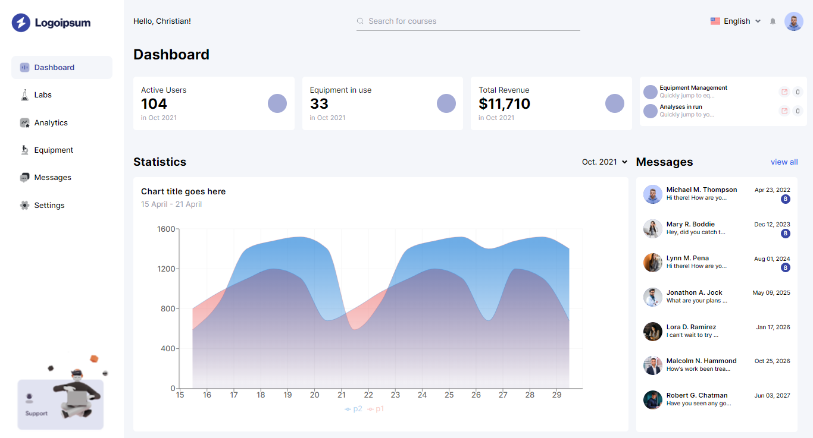

# React Dashboard

This is a dashboard landing page built with React v16, Tailwind CSS, vanilla CSS, Google Fonts, React Icons, Recharts.js, and media queries.

## Tools

This project was built with the following tools:

- [React](https://reactjs.org/)
- [Tailwind CSS](https://tailwindcss.com/)
- [Recharts.js](https://recharts.org/en-US/)
- [React Icons](https://react-icons.github.io/react-icons/)
- [Google Fonts](https://fonts.google.com/)
- Media queries

## Installation and Usage

To install and run the application, follow these steps:

1. Clone the repository:
   
`git clone https://github.com/marufalaslam/react-dashboard.git`

2. Install dependencies:

`cd react-dashboard`

`npm install`

3. Start the development server:

`npm start`

4. Open [http://localhost:3000](http://localhost:3000) in your browser.

## License

This repository is not licensed and is open for all.
